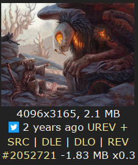

# Reverser

A content aggregator for a variety of sites to make uploading to e6 easier. Created because Saucenao doesn't support all the sites I want it to.

You provide links where the artist is uploading their content to. The content will then be scraped of those sites and put into iqdb (a reverse image search software). It also checks e6' version of iqdb to provide you information on if submissions are already uploaded, or if the current upload has a better version available elsewere.

It's also useful to clean up `source:none artist_name` searches.

Image dimensions and filesize are displayed, links to the original submission, the direct link of the downloaded file, and a link to start reverse image search for similar already scraped files.

The current upload on e6 is only 0.3x of the dimensions from the twitter post. It's also 1.83MB larger, a prime example for replacement. Please check manually if the file is actually superior, just because the filessize is greater doesn't mean that the visual quality is too. 

You can also search for non-uploaded submission for artists. How well this works depends on the artist and page. Some artists don't seperate their personal and art accounts and post irrelevant content which would also appear in this list.

## Limitations

E6 is limiting iqdb to one call per two seconds, which means that you will need to potentially wait for hours just to process a single artist. That means that large artists can take hours to update their iqdb information. There is nothing that can be done about it.

## Currently supported sites
* Artstation
* Baraag
* Deviantart
* Furaffinity
* FurryNetwork
* Inkbunny
* Newgrounds
* Pawoo
* Piczel
* Pixiv
* Reddit
* Sofurry
* Tumblr (kind of)
* Twitter
* Weasyl

### Tumblr

Tumblr doesn't expose the full resolution image through normal means. Getting full resolution on tumblr is a bit more compicated. Here's what you need to do, and what is done for you. Manual steps are marked with (*)
1. Reblog every post of the blog
1. (*) Download an archive of your blog
1. (*) Upload the archive through the tumblr uploader
1. (*) Remove drafts from your blog with the [Mega-Editor](https://www.tumblr.com/mega-editor/draft/)
1. Import full resolution files from the uploaded archive

The first step starts when you add a tumblr url to an artist. Instead of downloading the image like all other scrapers, it reblogs them.

## Captchas

A few sites throw captchas at you when trying to login through an automated browser. You will need to solve these captchas manually. Navigate to `http://localhost:7900` and connect to see what is happening inside the automated browser. Solve captchas as needed when added artist urls or enqueuing new updates.

## Configuration

A few scraper require credentials to work, this is how you can configure them. Higher entries in this list overwrite the lower ones.
1. Environment variables prefixed with `REVERSER_`. Values are loaded with `Psych.safe_load`, which means you are able to provide complex types like arrays and hashes. If a config ends with `?`, omit it from the environment variable name.
1. Entries in the file at `REVERSER_CUSTOM_CONFIG_PATH`, or `config/reverser_custom_config.yml` if the environment variable is not set.
1. Entries in the file at `config/reverser.yml`. Look here to see what you can/need to configure for more scraper to work. There are also a few other settings you can tweak, like disabling individual scrapers.

## How do I actually use this?
The following software is required to get started:
 * Latest version of Docker ([download](https://docs.docker.com/get-docker))
 * Latest version of Docker Compose ([download](https://docs.docker.com/compose/install))
 * Git ([download](https://git-scm.com/downloads))

### Windows users

Install a WSL distribution, enable WSL2, and clone the project inside there. Executing docker inside WSL will still work, without directly accessing the host filesystem. This will give you a significant performance boost.

### Installation

1. Clone the repo with `git clone https://github.com/earlopain/reverser.git`.
1. `cd` into the repo.
1. Run `docker-compose up`. The container is now available at `http://localhost:9000`.
1. Get inside the container with `docker-compose run reverser sh`.
1. Run `bin/rails assets:generate_spritemap` to stich the favicons in one image.
1. Run `RAILS_ENV=test bin/rails db:prepare` to setup the test database for later use.

This project is only meant to run locally on your machine. You may host it somewhere and make it accessible to others, but be aware that there are no user accounts or fine grained permissions. Everyone can do anyhting.

### Development tools

The compose file contains services to easily run some developments tools:
* `docker-compose run --rm rspec`
* `docker-compose run --rm rubocop`

You can pass addition parameters like individual test files for rspec or `-a` for rubocop simply by appending it to the command. I suggest you make an alias for these. You may also run these commands locally, since docker does add a fair bit of startup overhead.

#### Solargraph

The project works out of the box with the [VSCode solargraph extension](https://marketplace.visualstudio.com/items?itemName=castwide.solargraph). If it's not working execute the "Reload Window" command. The extension doesn't cope with the language server not being available on startup and refused to work altogether until a full reload is performed.
